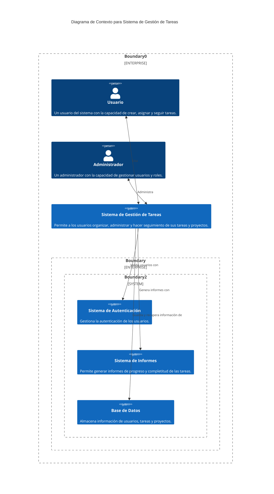
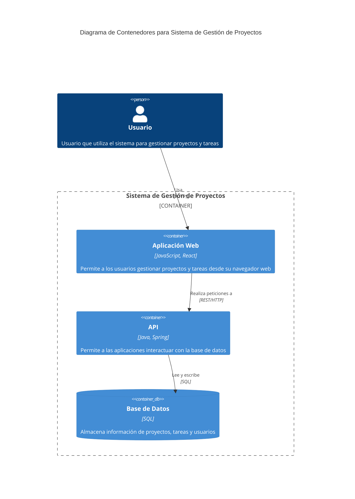
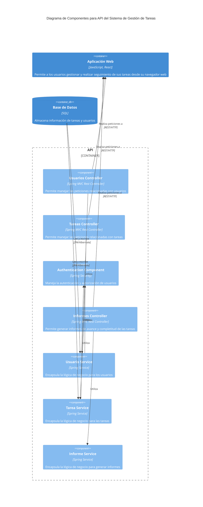
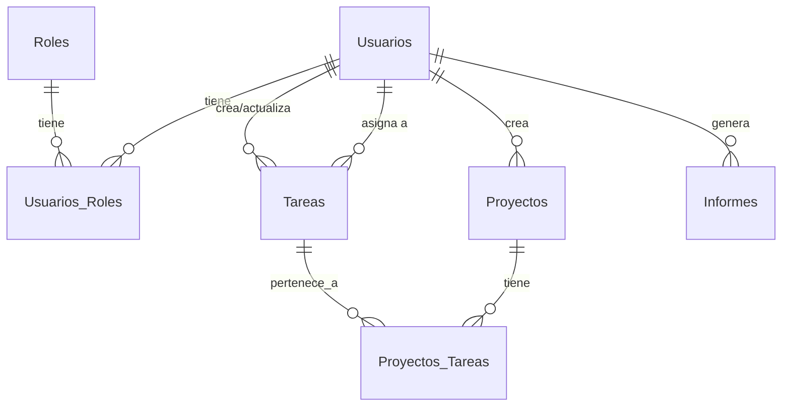

## 1. Diagrama de Contexto

## 2. Diagrama de Contenedores

## 3. Diagrama de Componentes

# Base de datos

Las tablas relacionadas con la autenticación y roles están en tonos azules, las tareas y los proyectos en verdes y los informes en tonos anaranjados:

# Requisitos para la Pantalla de Inicio de Sesión

## Introducción
Este documento tiene como objetivo detallar los requisitos funcionales y no funcionales para el diseño e implementación de una pantalla de inicio de sesión robusta y escalable. La autenticación se realizará mediante una base de datos y una API.

---

## Requisitos Funcionales

### 1. Campos de entrada
- **Usuario**: El usuario debe poder ingresar un nombre de usuario o una dirección de correo electrónico.
- **Contraseña**: Debe haber un campo para la contraseña.

### 2. Botones
- **Iniciar sesión**: Al hacer clic, inicia el proceso de autenticación.
- **Olvidé mi contraseña**: Enlace para recuperar la contraseña.
- **Crear una cuenta**: Enlace para ir a la página de registro.

### 3. Validaciones
- Validar el formato del correo electrónico (si se usa).
- Validar la longitud mínima de la contraseña.

### 4. Autenticación mediante Base de Datos
- Consultar la base de datos para verificar si el usuario y la contraseña son válidos.
- Protección contra ataques de SQL Injection.

### 5. Autenticación mediante API
- Enviar los datos ingresados a una API segura para la autenticación.
- Recibir una respuesta de la API para determinar si el acceso es válido.
  
### 6. Feedback al Usuario
- Mostrar mensajes de error cuando la autenticación falle.
- Mostrar una notificación de "Cargando" durante la verificación.

---

## Requisitos No Funcionales

### 1. Rendimiento
- La autenticación debe completarse en menos de 2 segundos en condiciones normales de red.

### 2. Escalabilidad
- Debe soportar al menos 1000 usuarios concurrentes.

### 3. Seguridad
- Las contraseñas deben almacenarse de forma segura (hash y sal).
- Todas las transacciones de datos deben ser encriptadas mediante HTTPS.
  
### 4. Usabilidad
- Diseño intuitivo y fácil de usar.
- Compatible con navegadores web modernos.

### 5. Disponibilidad
- El servicio de autenticación debe estar disponible el 99.9% del tiempo.

### 6. Mantenibilidad
- El código debe estar bien documentado.
- Facilidad para añadir nuevos métodos de autenticación en el futuro.

---

Para cualquier cambio o aclaración de estos requisitos, se deberá notificar y actualizar este documento.