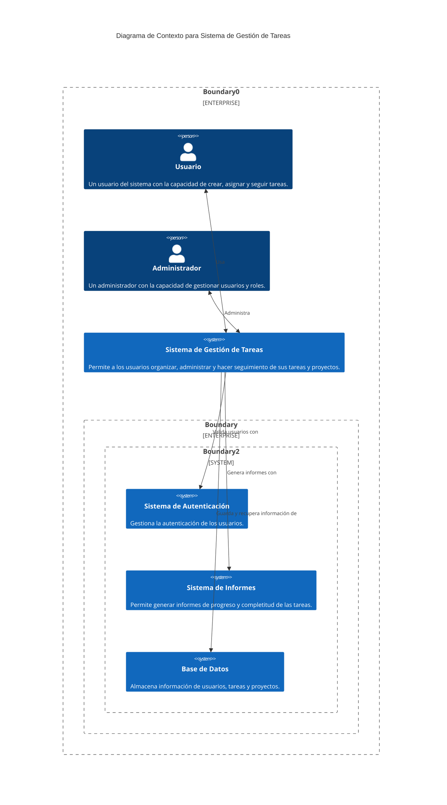
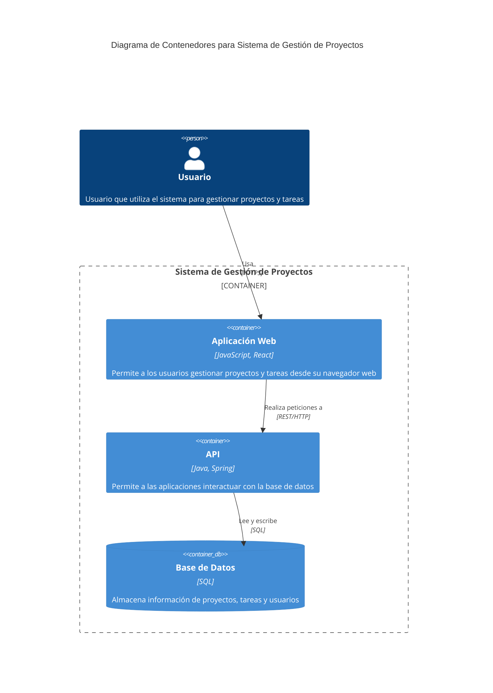
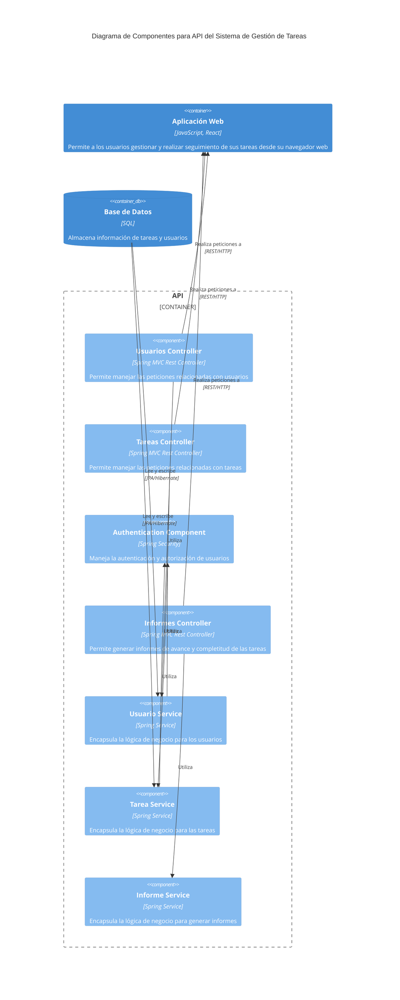
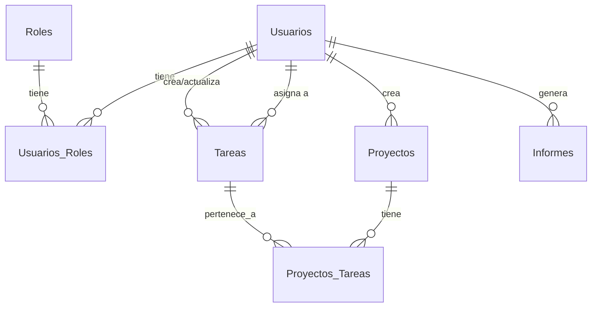

## 1. Diagrama de Contexto

## 2. Diagrama de Contenedores

## 3. Diagrama de Componentes

# Base de datos

Las tablas relacionadas con la autenticación y roles están en tonos azules, las tareas y los proyectos en verdes y los informes en tonos anaranjados:

