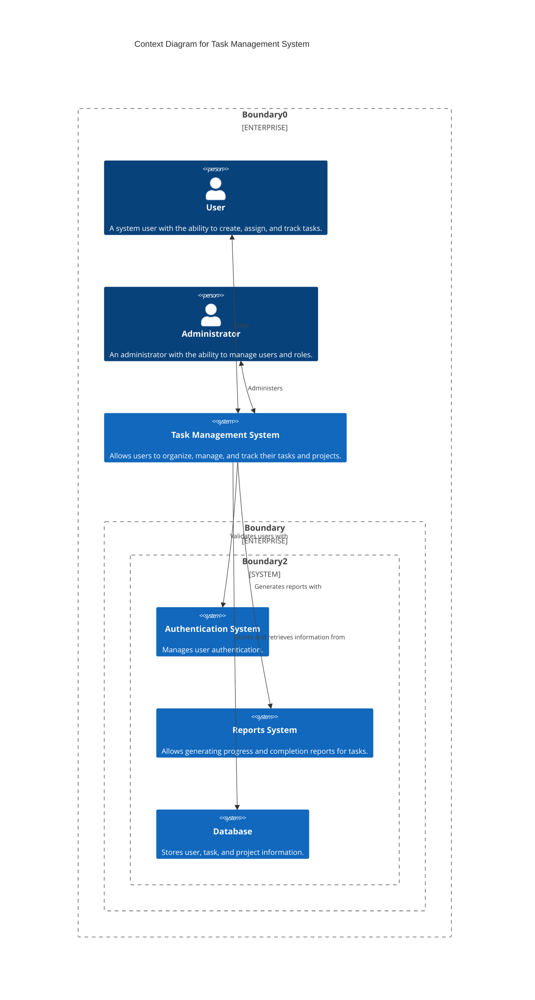
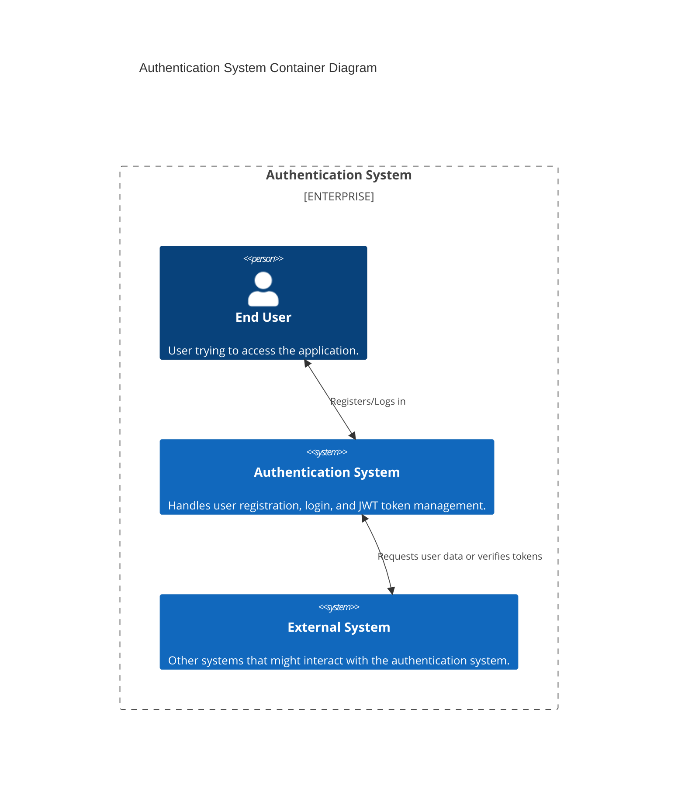
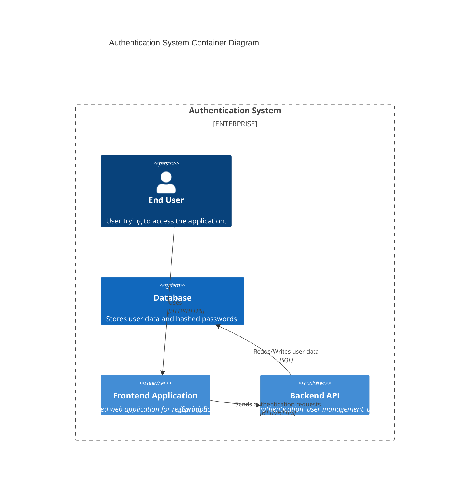
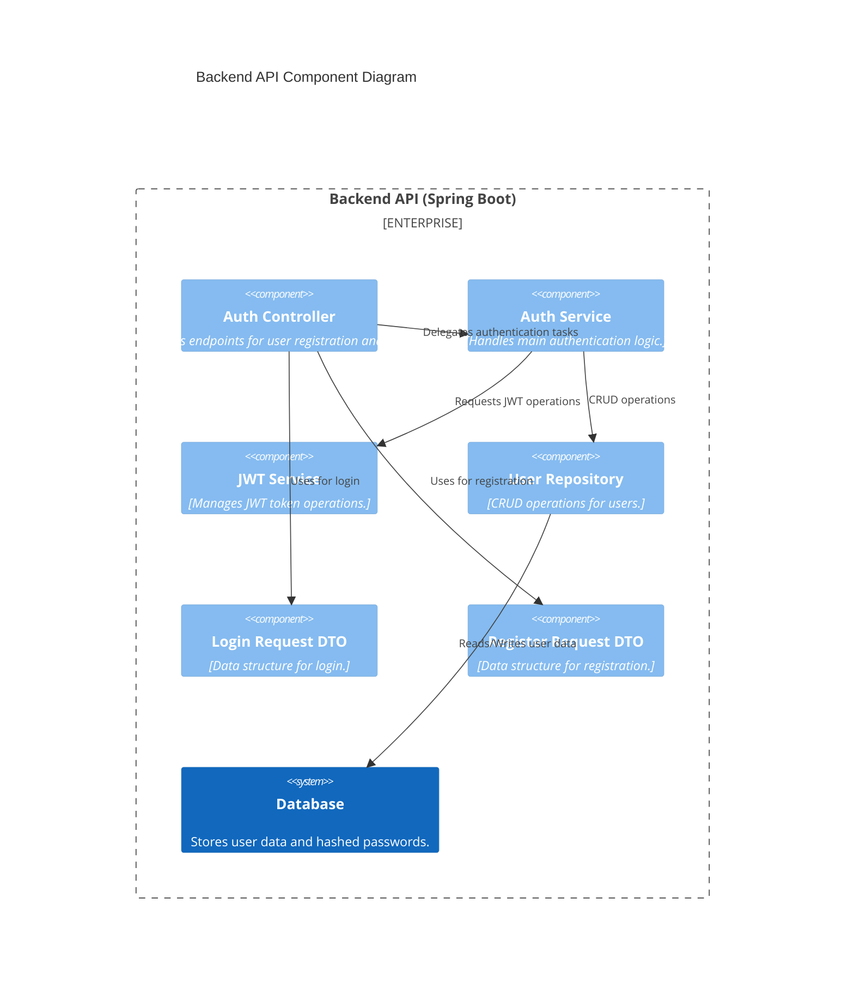
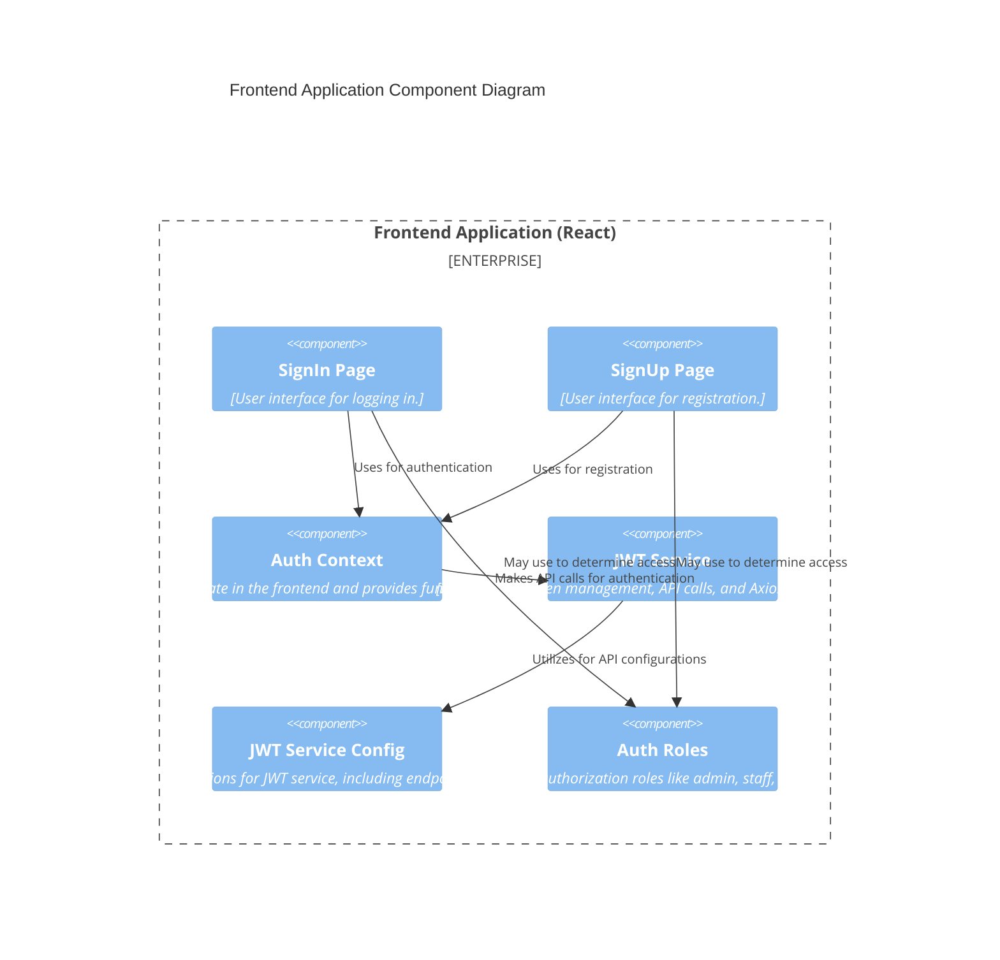
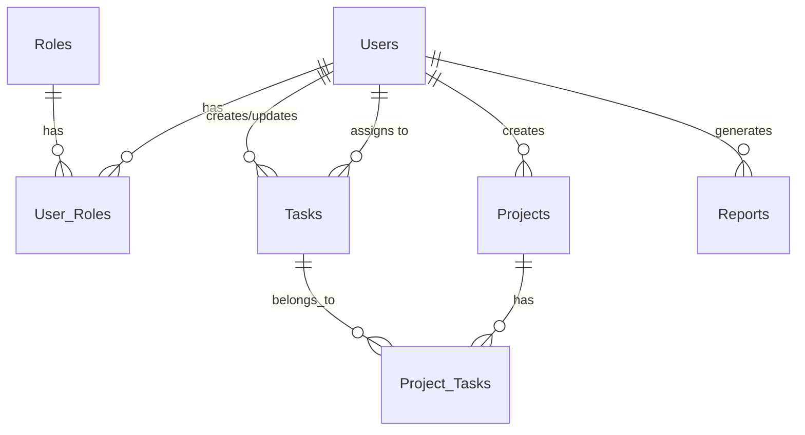

## 1. Context Diagram

## 2. Container Diagram

## 3. Component Diagram

# Database

The tables related to authentication and roles are in shades of blue, tasks and projects in green, and reports in shades of orange:

