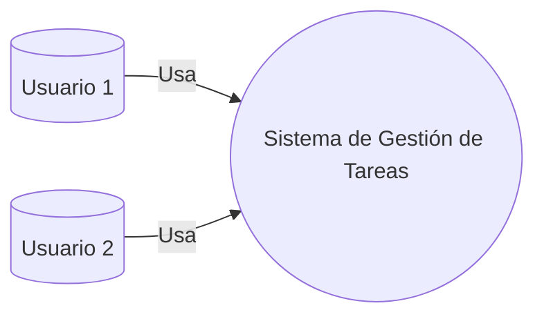
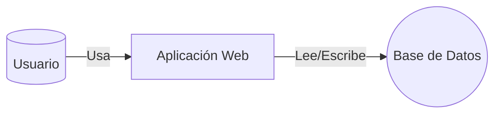
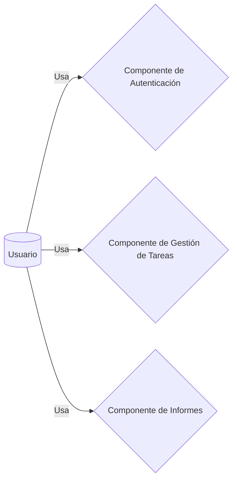

## 1. Diagrama de Contexto

```mermaid
graph LR
  User1[(Usuario 1)]
  User2[(Usuario 2)]
  System((Sistema de Gestión de Tareas))
  User1 -->|Usa| System
  User2 -->|Usa| System
```

## 2. Diagrama de Contenedores

```mermaid
graph LR
  User1[(Usuario)]
  WebApp[Aplicación Web]
  DB((Base de Datos))
  User1 -->|Usa| WebApp
  WebApp -->|Lee/Escribe| DB
```

## 3. Diagrama de Componentes

```mermaid
graph LR
  User1[(Usuario)]
  AuthComp{Componente de Autenticación}
  TaskComp{Componente de Gestión de Tareas}
  ReportComp{Componente de Informes}
  User1 -->|Usa| AuthComp
  User1 -->|Usa| TaskComp
  User1 -->|Usa| ReportComp
```
